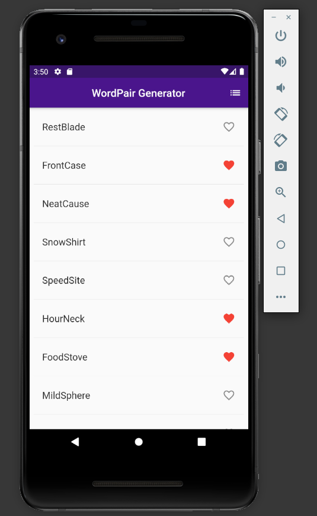
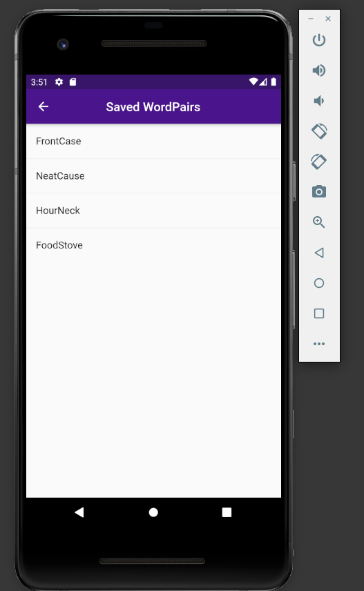

# wordpair_generator

A new Flutter project.

# Version  
* Flutter 2.4.0
* Tools • Dart 2.14.0

##  dependencies 

* english_words: ^4.0.0
## Getting Started

This project is a starting point for a Flutter application.

this app simply generates randmon words using english_words package.
to use this package as your librury check out this [link][1]

[1]: https://pub.dev/packages/english_words/install "english_words" 

it works for both __IOS__ and **Andriod** platforms perfectly .

here's sample picture taken on Andriod.

july 25. 2021

